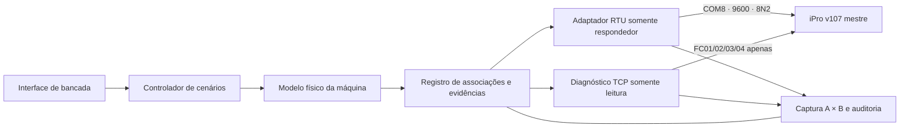

# Arquitetura proposta — bancada profissional iPro

## Decisão arquitetural

A interface definitiva não deve codificar endereços Modbus dentro dos widgets. A bancada será dividida em camadas, com rastreabilidade explícita entre o modelo físico, a evidência e cada transporte. Isso preserva a COM8 funcional e permite substituir uma associação experimental sem alterar a lógica serial.

## Módulos

- **Modelo físico:** temperaturas, pressões, umidade, proteções, atuadores, falhas e estados derivados. Trabalha em unidades de engenharia e não conhece registradores.
- **Registro de associações:** para cada sinal guarda origem, I/O físico, `sns[]`, `W1[]`, endereço RTU, tipo, escala, sinal, ordem de palavras, confiança e evidência. Valores `DESCONHECIDO` são válidos e visíveis.
- **Adaptador RTU:** reaproveita o respondedor atual sem mudar COM8/9600/8N2, Slave 1 FC04 e Slave 2 FC03. Aceita somente consultas do mestre e monta a resposta a partir do registro.
- **Diagnóstico TCP:** processo separado, somente leitura, com lista positiva de FC01/02/03/04. FC05/06/15/16 são rejeitadas antes de abrir a conexão.
- **Captura e comparação:** snapshots A/B imutáveis, agrupados por escravo/função/bloco/posição. O filtro “Mostrar somente alterações” inicia ativado e o resumo informa posições e diferenças.
- **Auditoria:** registra data, fonte, operador, estado anterior/novo e motivo de cada promoção de confiança. Associação manual nunca vira confirmada automaticamente.

## Telas do protótipo

1. **Visão geral:** saúde dos transportes, modo seguro e variáveis prioritárias.
2. **Sensores:** edição em unidades de engenharia, limites e indicação clara de associação confirmada/em teste/desconhecida.
3. **Entradas e saídas:** imagem lógica dos Pb/DI/RL/OUT, sem comandar o iPro.
4. **Mapa e evidências:** matriz pesquisável, fonte por linha e fluxo de promoção da confiança.
5. **Comparador A × B:** resumo no topo, somente alterações por padrão e opção para todas as posições.
6. **Diagnóstico TCP:** leituras controladas e log; nenhuma ação de escrita é oferecida.

## Barreiras de segurança

- Nenhuma rotina de download, configuração, reinicialização ou reset do iPro.
- O iPro continua sendo mestre no enlace RS485; o notebook apenas responde como Slaves 1 e 2.
- A porta serial é possuída por um único processo; o protótipo não toca nela.
- No TCP, somente funções de leitura entram na lista positiva. Funções de escrita são bloqueadas por validação e não aparecem na interface.
- Cenários alteram apenas o modelo do simulador. Saídas exibidas representam estados observados/modelados, nunca comandos arbitrários ao controlador.
- Antes de modificar um arquivo funcional, criar cópia com timestamp e hash. Os artefatos desta etapa são novos e não substituem código operacional.

## Sequência segura de implementação

1. Validar a matriz e o protótipo com o operador.
2. Extrair o modelo físico sem alterar o adaptador serial.
3. Introduzir o registro versionado de associações, inicialmente com todos os RTU desconhecidos exceto associações manuais marcadas `EM TESTE`.
4. Conectar a nova interface ao modelo em modo offline.
5. Executar testes automatizados do codec e das barreiras de escrita.
6. Integrar o respondedor RTU existente atrás de uma chave explícita de bancada.
7. Validar cada variável por comparação A × B e promover confiança somente com evidência registrada.
